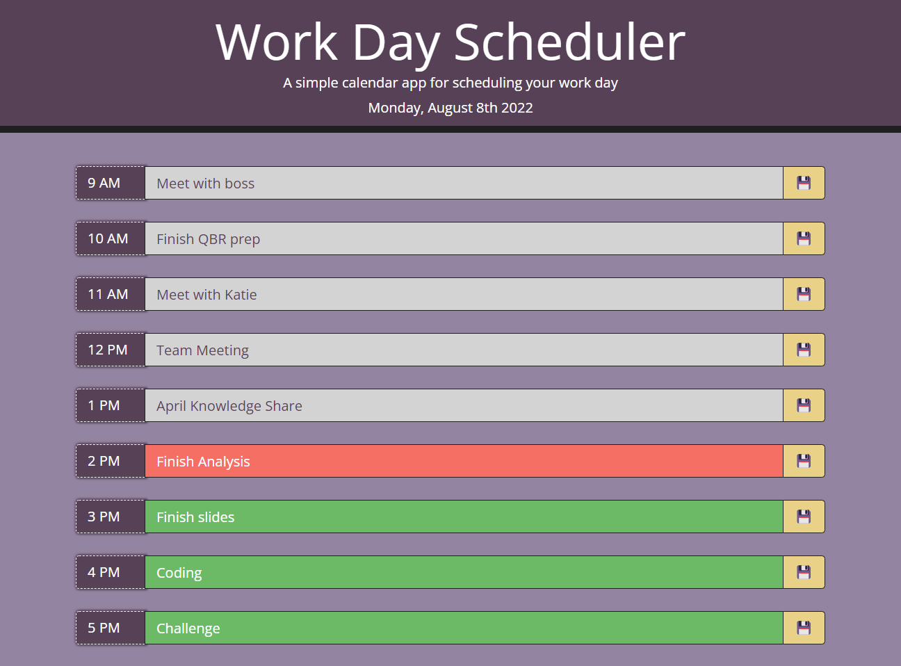

# 05 Third-Party APIs: Work Day Scheduler

## Description of Application

This application creates a dynamic daily planner for user. When the planner is opened, the user is presented with the current date and day of the week. There are time blocks for a standard 8 hour work day (9AM - 5PM), the user can click into each box and input a task for the hour. Upon pressing save, the data is stored in local storage. Upon refresh, saved data persists. The time blocks are color coded; past hours are gray, current hour is red and future hours are green. 

<br>

## User Functionality

```md
GIVEN I am using a daily planner to create a schedule
WHEN I open the planner
THEN the current day is displayed at the top of the calendar
WHEN I scroll down
THEN I am presented with timeblocks for standard business hours
WHEN I view the timeblocks for that day
THEN each timeblock is color coded to indicate whether it is in the past, present, or future
WHEN I click into a timeblock
THEN I can enter an event
WHEN I click the save button for that timeblock
THEN the text for that event is saved in local storage
WHEN I refresh the page
THEN the saved events persist
```
<br>

## Live Link and Mock-Up

[Workday Scheduler Live Link](https://isayani.github.io/third-party-api-day-planner/)

The following image shows the web application's appearance and functionality:



- - -
© 2022 ISayani Creative Services, Confidential and Proprietary. All Rights Reserved.
